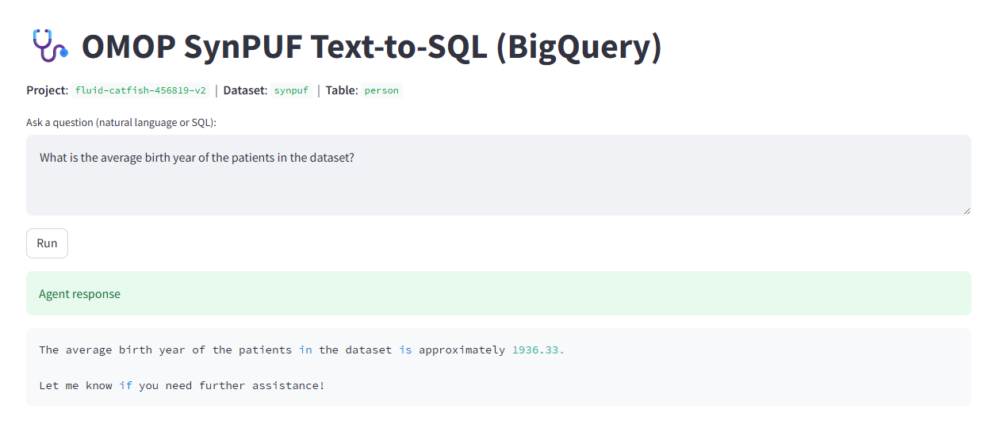

# OMOP SynPUF Text‑to‑SQL Agent 🌐

A Streamlit web app that lets you ask natural language questions and runs
LLM‑generated SQL against the CMS SynPUF OMOP dataset in BigQuery.



## Quick start (local)

```bash
python -m venv .venv && source .venv/bin/activate
pip install -r requirements.txt

export OPENAI_API_KEY=sk-...
export GOOGLE_PROJECT_ID=fluid-catfish-456819-v2
export OMOP_DATASET_ID=synpuf
export GOOGLE_APPLICATION_CREDENTIALS=/path/to/sa-key.json

streamlit run omop_text_to_sql_agent.py
